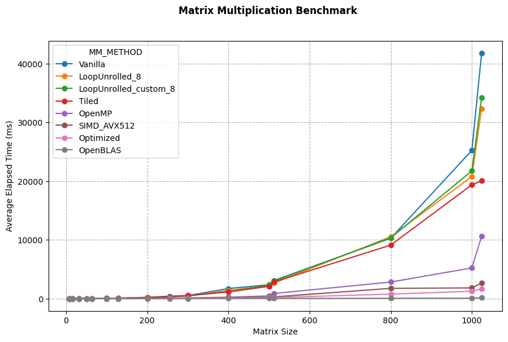
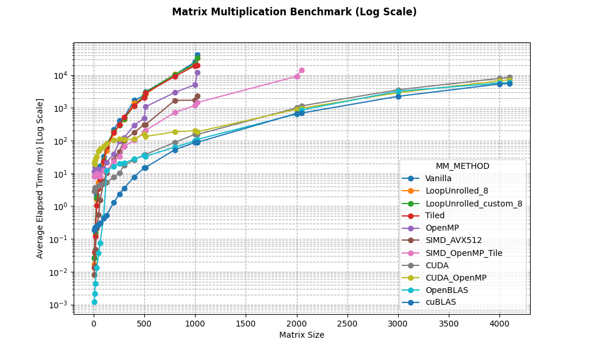

# NN3: Optimized Matrix Multiplication and Neural Network Framework

C++ implementation of matrix multiplication algorithms leveraged into a flexible neural network framework, built from scratch. This project demonstrates various optimization techniques including loop unrolling, cache tiling, SIMD vectorization (AVX-512), and OpenMP parallelization.

## Table of Contents

- [Project Overview](#project-overview)
- [Project Structure](#project-structure)
- [Matrix Multiplication Optimization](#matrix-multiplication-optimization)
  - [Implemented Algorithms](#implemented-algorithms)
  - [CUDA GPU Acceleration](#cuda-gpu-acceleration)
  - [Benchmarking Results](#benchmarking-results)
- [Neural Network Framework](#neural-network-framework)
  - [Architecture](#architecture)
  - [Supported Components](#supported-components)
  - [Training Examples](#training-examples)
- [Python Bindings (PyNN3)](#python-bindings-pynn3)
  - [Installation](#installation)
  - [Quick Start](#quick-start)
  - [API Reference](#api-reference)
- [Building the Project](#building-the-project)
- [Running Tests and Benchmarks](#running-tests-and-benchmarks)
- [Dependencies](#dependencies)
- [Performance Analysis](#performance-analysis)
- [Future Improvements](#future-improvements)
- [Contributors](#contributors)

---

## Project Overview

This project consists of two main components:

1. **Optimized Matrix Multiplication Library**: Matrix structure (with basic/algebraic operations, I/O, etc.) and multiple implementations of matrix multiplication with varying optimization strategies, evaluated against OpenBLAS as a reference implementation
2. **CUDA GPU Acceleration**: Optional GPU-accelerated matrix multiplication using CUDA with tiled shared memory kernels
3. **Neural Network Framework**: A flexible, template-based neural network library supporting:
   - Dense layers with customizable activations
   - Multiple activation functions (ReLU, LeakyReLU, Sigmoid, Tanh, Softmax, Linear)
   - Loss functions (MSE, Binary Cross-Entropy, Categorical Cross-Entropy)
   - Optimizers (SGD, Adam)
   - Preprocessing utilities (One-hot encoding)
   - Metrics for binary and multi-class classification
   - Backpropagation
4. **Python Bindings (PyNN3)**: High-level Python interface using pybind11, allowing seamless integration with NumPy

The library is designed for educational purposes and performance experimentation, demonstrating how low-level optimizations can dramatically improve computational efficiency.

---

## Project Structure

```
neuralnets-3-neuralnets/
├── include/
│   ├── matrix/
│   │   ├── matrix.hpp              # Matrix class with basic operations
│   │   ├── matmul.hpp              # Matrix multiplication implementations
│   │   ├── matmul_cuda.hpp         # CUDA interface (C++ compatible)
│   │   ├── matmul_cuda.cuh         # CUDA kernel implementations
│   │   ├── matmul_cuda.cu          # CUDA compilation unit
│   │   └── iohelper.hpp            # CSV I/O utilities
│   ├── neuralnets/
│   │   ├── neuralnets.hpp          # Neural network and layer classes
│   │   ├── activation.hpp          # Activation functions
│   │   ├── loss.hpp                # Loss functions
│   │   ├── optimizer.hpp           # Optimization algorithms
│   │   ├── metrics.hpp             # Performance metrics
│   │   └── preprocessing.hpp       # Data preprocessing utilities
│   ├── bindings/
│   │   ├── pynn3.cpp               # Python module definition
│   │   ├── pynn3.hpp               # High-level Python interface
│   │   └── numpy_matrix_helper.hpp # NumPy <-> Matrix conversion helper
│   └── utils/
│       └── bench.hpp               # Benchmarking utilities
├── tests/
│   ├── unit/                       # Unit tests
│   ├── benchmark/                  # Benchmark tests
│   ├── integration/                # Python integration tests
│   ├── test_classification_neuralnet.cpp       # Binary classification
│   ├── test_regression_neuralnet.cpp           # Regression
│   └── test_multi_classification_neuralnet.cpp # Multi-class classification
├── output/
│   └── benchmark/
│       ├── matrix_mult_benchmark_logs.csv
│       └── plot_benchmark.ipynb    # Benchmark visualization
├── data/                           # Sample datasets
├── docs/                           # Documentation
└── CMakeLists.txt
```

The core library is implemented as header-only modules to simplify experimentation and inlining of performance-critical code.

---

## Matrix Multiplication Optimization

### Implemented Algorithms

The project implements several matrix multiplication strategies, each demonstrating specific optimization techniques:

#### 1. **Vanilla (Baseline)**

```cpp
C[i][j] = Σ A[i][k] * B[k][j]
```
- Standard triple-nested loop implementation ~ O(n³)
- No optimizations applied
- Serves as baseline for comparison

To call it, use:
```cpp
static Matrix<T> mm_vanilla(const Matrix<T> &A, const Matrix<T> &B)
```

#### 2. **Loop Unrolling (4x, 8x, Nx)**
```cpp
// Process n elements at a time
for (; k + N_UNROLL - 1 < N; k += N_UNROLL) {
    for (std::size_t u = 0; u < N_UNROLL; ++u) {
        acc[u] += A(i, k + u) * B(k + u, j);
    }
}
// Add the partial sums together
T sum = T{};
for (std::size_t u = 0; u < N_UNROLL; ++u) {
    sum += acc[u];
}
```
- Reduces loop overhead by processing multiple iterations together
- Improves instruction-level parallelism (ILP)
- Efficient register utilization
- Reduce branch predictions with fewer loop iterations

To call it, use:
```cpp
// 4-way loop unrolling
static Matrix<T> mm_unrolled4(const Matrix<T> &A, const Matrix<T> &B)

// 8-way loop unrolling
static Matrix<T> mm_unrolled8(const Matrix<T> &A, const Matrix<T> &B)

// Custom N-way loop unrolling
template<std::size_t N_UNROLL>
static Matrix<T> mm_unrolled(const Matrix<T> &A, const Matrix<T> &B)
```

#### 3. **Cache Tiling (Blocking)**
```cpp
// Process tile_size x tile_size blocks
for (ii = 0; ii < N; ii += tile_size)
    for (jj = 0; jj < N; jj += tile_size)
        for (kk = 0; kk < N; kk += tile_size)
            // Inner computation on tiles
```
- Improves cache locality by processing matrix in blocks
- Reduces cache misses significantly (tile size typically matched to L1/L2 cache size)

To call it, use:
```cpp
template<std::size_t TILE_SIZE>
static Matrix<T> mm_tiled(const Matrix<T> &A, const Matrix<T> &B)
```

#### 4. **SIMD AVX-512 Vectorization**
```cpp
// Process 8 doubles (512 bits) simultaneously
__m512d va = _mm512_loadu_pd(&A[i*K + k]);
__m512d vb = _mm512_loadu_pd(&B_t[j*K + k]);
vc = _mm512_fmadd_pd(va, vb, vc);
```
- Exploits AVX-512 SIMD instructions for data parallelism
- Processes 8 double-precision floats per instruction
- Requires B matrix transposition for efficient contiguous memory access

To call it, use:
```cpp
static Matrix<T> mm_avx512(const Matrix<T> &A, const Matrix<T> &B)
```

#### 5. **OpenMP Parallelization**
```cpp
#pragma omp parallel for schedule(static)
for (size_t i = 0; i < M; ++i) {
    // Matrix multiplication per row
}
```
- Thread-level parallelism across CPU cores
- Static scheduling for load balancing and minimal overhead
- Ideally scales with number of cores (matrix multiplication is *embarrassingly parallel* across rows or blocks)

To call it, use:
```cpp
static Matrix<T> mm_openmp(const Matrix<T> &A, const Matrix<T> &B)
```

#### 6. **Optimized (Combined)**

- Combines multiple optimization techniques:
  - Multi-threading (OpenMP)
  - Vectorization (AVX-512)
  - Cache optimization (Tiling)
- Best performance among custom implementations

To call it, use:
```cpp
static Matrix<T> mm(const Matrix<T> &A, const Matrix<T> &B) // default method
```

#### 7. **OpenBLAS (Reference)**
- Industry-standard optimized BLAS library
- Highly tuned assembly code for specific architectures
- Serves as performance ceiling for comparison

### CUDA GPU Acceleration

The project includes optional CUDA support for GPU-accelerated matrix multiplication, providing significant speedups for large matrices.

#### Architecture

The CUDA implementation uses a **three-file architecture** to separate concerns:

| File | Purpose |
|------|---------|
| `matmul_cuda.hpp` | C++ compatible header (no CUDA syntax) - can be included by any C++ code |
| `matmul_cuda.cuh` | CUDA implementation with kernels and templates (nvcc only) |
| `matmul_cuda.cu` | Compilation unit providing linkable symbols |

#### Tiled Shared Memory Kernel

```cuda
// 16x16 tiled matrix multiplication kernel
template<typename T>
__global__ void matmul_tiled_kernel(const T* A, const T* B, T* C,
                                     size_t M, size_t N, size_t K) {
    __shared__ T As[TILE_SIZE][TILE_SIZE];
    __shared__ T Bs[TILE_SIZE][TILE_SIZE];
    
    // Load tiles into shared memory
    // Compute partial products
    // Accumulate results
}
```

**Key Optimizations**:
- **Shared memory tiling**: Reduces global memory bandwidth requirements
- **Coalesced memory access**: Threads access consecutive memory locations
- **Register blocking**: Maximizes arithmetic intensity
- **Template support**: Works with both `float` and `double` precision

#### Usage

```cpp
#include "matrix/matmul.hpp"

// CUDA is automatically used when available and beneficial
Matrix<float> C = MatMul<float>::mm(A, B);

// Or explicitly request CUDA multiplication
Matrix<float> C = MatMul<float>::mm_cuda(A, B);

// Check CUDA availability
if (cuda_matmul::isCudaAvailable()) {
    std::cout << "CUDA device: " << cuda_matmul::getCudaDeviceInfo() << std::endl;
}
```

#### Automatic Backend Selection

The `MatMul::mm()` function automatically selects the best backend:
1. **CUDA**: Used for large matrices when GPU is available
2. **OpenMP + AVX-512**: CPU fallback with vectorization
3. **Vanilla**: For very small matrices where overhead dominates

#### Building with CUDA

CUDA support is automatically detected by CMake:

```bash
cmake ..  # Detects CUDA automatically
make

# Verify CUDA tests
./test_matrix_cuda_mult
```


### Benchmarking Results

The benchmark suite (`test_benchmark`) measures performance across different matrix sizes and generates detailed performance reports.

#### Running the Benchmark

```bash
cd build
./test_benchmark <matrix_size>

# Example: Benchmark 512x512 matrices
./test_benchmark 512
```

#### Benchmark Script

For comprehensive testing across multiple sizes:
```bash
bash tests/run_benchmark.sh
```

This runs benchmarks for matrix sizes: 8, 10, 16, 32, 64, 128, 200, 256, 512, 1024 and logs results to `output/benchmark/matrix_mult_benchmark_logs.csv`.

#### Results

Detailed numerical results are logged to CSV files and performance analysis is visualized by:
```
output/benchmark/plot_benchmark.ipynb
```

The Jupyter notebook provides:
- **Linear scale plots**: Absolute performance comparison



- **Log scale plots**: Better visualization across different matrix sizes


**Key Observations**:
1. **Small matrices (< 32×32)**: Simple algorithms often faster due to overhead (thread creation cost)
2. **Medium matrices (64-256)**: Vectorization and parallelization show clear benefits
3. **Large matrices (> 512)**: Combined optimizations approach OpenBLAS performance
4. **OpenBLAS**: Consistently fastest for all the matrix sizes (highly tuned)

---

## Neural Network Framework

### Architecture

The framework follows a modular, template-based design:

```cpp
template<typename T>
class NeuralNets {
    std::vector<NeuralLayer<T>> layers;
    Optimizer<T>& optimizer;
    Loss<T>& loss_function;
    
    void train(const Matrix<T>& X, const Matrix<T>& y, int epochs);
    Matrix<T> predict(const Matrix<T>& X);
};
```

**Key Features**:
- Template-based for type flexibility (float, double)
- Layer-wise forward and backward propagation
- Automatic gradient computation
- Support common initialization strategy (e.g., He initialization)

### Supported Components

#### Activation Functions

| Function | Forward | Derivative | Use Case |
|----------|---------|------------|----------|
| **ReLU** | max(0, x) | 1 if x>0 else 0 | Hidden layers|
| **LeakyReLU** | x if x>0 else 0.01x | 1 if x>0 else 0.01 | Hidden layers (preventing dead neurons) |
| **Tanh** | tanh(x) | 1 - tanh²(x) | Hidden layers |
| **Sigmoid** | 1/(1+e^(-x)) | σ(x)(1-σ(x)) | Binary classification output |
| **Softmax** | e^(x_i) / Σe^(x_j) | Jacobian matrix | Multi-class classification output |
| **Linear** | x | 1 | Regression output |

#### Loss Functions

| Function | Formula | Use Case |
|----------|---------|----------|
| **MSE** | (1/n)Σ(ŷ - y)² | Regression |
| **Binary Cross-Entropy** | -(1/n)Σ[y·log(ŷ) + (1-y)·log(1-ŷ)] | Binary classification |
| **Categorical Cross-Entropy** | -(1/n)Σ_i Σ_j y_ij·log(ŷ_ij) | Multi-class classification |

#### Optimizers

| Optimizer | Update Rule | Parameters |
|-----------|-------------|------------|
| **SGD** | W ← W - η·∇W | Learning rate (η) |
| **Adam** | Adaptive moment estimation | Learning rate (η), β₁, β₂, ε |

#### Metrics

| Metric Type | Available Metrics |
|-------------|------------------|
| **Binary Classification** | BinaryAccuracy, BinaryPrecision, BinaryRecall |
| **Multi-Class Classification** | MultiClassAccuracy, MultiClassPrecision (macro), MultiClassRecall (macro) |
| **Regression** | MeanSquaredError, MeanAbsoluteError |

#### Normalization Layers

| Layer | Formula | Parameters | Use Case |
|-------|---------|------------|----------|
| **LayerNormalization** | y = γ·((x-μ)/σ) + β | Learnable scale (γ) and shift (β) per feature | Stabilize training, reduce internal covariate shift |

**LayerNormalization** normalizes across features (within each sample), making training more stable and often allowing higher learning rates. It can be optionally applied to hidden layers:

```cpp
LayerNormalization<double> ln(64);  // 64 features
nn.add_layer(input_size, 64, relu, &ln);  // Add layer with normalization
```

Key characteristics:
- Normalizes each sample independently (mean=0, variance=1 across features)
- Learnable γ (scale) initialized to 1, β (shift) initialized to 0
- Gradients automatically computed during backpropagation
- Parameters (γ, β) updated by the optimizer

#### Preprocessing Utilities

| Utility | Methods | Description |
|---------|---------|-------------|
| **OneHotEncoder** | fit(), transform(), fit_transform(), inverse_transform() | sklearn-style one-hot encoding for categorical variables |

### Training Examples

#### Binary Classification

```cpp
#include "matrix/matrix.hpp"
#include "neuralnets/neuralnets.hpp"

int main() {
    // Setup
    BinaryCrossEntropyLoss<double> loss;
    SGD<double> optimizer(0.1);  // Learning rate = 0.1
    NeuralNets<double> nn(optimizer, loss);
    
    // Architecture: 2 inputs → 3 hidden (LeakyReLU) → 1 output (Sigmoid)
    LeakyReLU<double> leaky_relu;
    Sigmoid<double> sigmoid;
    nn.add_layer(2, 3, leaky_relu);
    nn.add_layer(3, 1, sigmoid);
    
    // Training data (10 samples, 2 features)
    Matrix<double> X(10, 2, {0.1, 0.2, 0.3, 0.4, ...});
    Matrix<double> y(10, 1, {0, 0, 0, 0, 0, 1, 1, 1, 1, 1});
    
    // Train
    nn.train(X, y, 100, true);  // 100 epochs, verbose
    
    // Predict
    Matrix<double> predictions = nn.predict(X);
    predictions.display();
    
    return 0;
}
```

#### Regression Example

```cpp
#include "matrix/matrix.hpp"
#include "neuralnets/neuralnets.hpp"

// Similar setup with different loss
MSELoss<double> mse_loss;
SGD<double> sgd(0.01);
NeuralNets<double> nn(sgd, mse_loss);

// Architecture for regression: no sigmoid at output
LeakyReLU<double> leaky_relu;
Linear<double> linear;
nn.add_layer(input_dim, 64, leaky_relu);
nn.add_layer(64, 32, leaky_relu);
nn.add_layer(32, output_dim, linear);

nn.train(X_train, y_train, 1000);
```

#### Multi-Class Classification Example

```cpp
#include "matrix/matrix.hpp"
#include "neuralnets/neuralnets.hpp"
#include "neuralnets/preprocessing.hpp"
#include "matrix/iohelper.hpp"

int main() {
    // Load data
    Matrix<double> X_train = IOHelper<double>::read_csv("X_train.csv", ',', true);
    Matrix<double> y_train_raw = IOHelper<double>::read_csv("y_train.csv", ',', true);
    
    // One-hot encode labels (e.g., classes 0, 1, 2)
    OneHotEncoder<double> encoder;
    Matrix<double> y_train = encoder.fit_transform(y_train_raw);
    std::size_t num_classes = encoder.get_num_classes();
    
    // Setup network with Softmax output
    CategoricalCrossEntropyLoss<double> loss;
    Adam<double> optimizer(0.01, 0.9, 0.999, 1e-8);
    NeuralNets<double> nn(optimizer, loss);
    
    // Architecture: input → 64 (LN) → 32 (LN) → num_classes (Softmax)
    LeakyReLU<double> leaky_relu;
    Softmax<double> softmax;
    LayerNormalization<double> ln1(64);
    LayerNormalization<double> ln2(32);
    
    nn.add_layer(X_train.cols(), 64, leaky_relu, &ln1);  // With LayerNorm
    nn.add_layer(64, 32, leaky_relu, &ln2);              // With LayerNorm
    nn.add_layer(32, num_classes, softmax);              // Softmax for multi-class
    
    // Train
    nn.train(X_train, y_train, 200, true);
    
    // Predict and evaluate
    Matrix<double> predictions = nn.predict(X_train);  // Probability distributions
    MultiClassAccuracy<double> accuracy;
    double acc = accuracy.eval_probs(predictions, y_train);
    std::cout << "Accuracy: " << acc * 100 << "%" << std::endl;
    
    return 0;
}
```


---

## Python Bindings (PyNN3)

The project includes Python bindings via **pybind11**, providing a high-level interface for neural network training and prediction. The Python module is called `pynn3`.

### Design Principles

- **NumPy Integration**: Users work exclusively with NumPy arrays
- **Hidden Internals**: C++ Matrix implementation is completely hidden
- **Zero-Copy Output**: Predictions are returned without unnecessary data copying
- **GIL Release**: Long-running training releases Python's GIL for threading

### Installation

#### Building the Module

```bash
cd build

# Enable Python bindings
cmake -DBUILD_PYTHON_BINDINGS=ON ..

# Build the module
make pynn3

# Module location: build/python/pynn3.cpython-*.so
```

#### Requirements

```bash
# System packages (Ubuntu/Debian)
sudo apt-get install python3-dev

# Python packages
pip install pybind11 numpy
```

### Quick Start

```python
import numpy as np
import pynn3 as nn

# Prepare data (NumPy arrays)
X = np.array([[0, 0], [0, 1], [1, 0], [1, 1]], dtype=np.float32)
y = np.array([[0], [1], [1], [0]], dtype=np.float32)

# Create network with optimizer and loss
model = nn.NeuralNets(
    optimizer=nn.SGD(learning_rate=0.5),
    loss=nn.MSE()
)

# Build architecture
model.add_layer(input_size=2, output_size=4, activation=nn.ReLU())
model.add_layer(input_size=4, output_size=1, activation=nn.Sigmoid())

# Train
model.train(X, y, epochs=1000, verbose=True)

# Predict (returns NumPy array)
predictions = model.predict(X)
print(predictions)
```

### API Reference

#### Network Class

```python
class NeuralNets:
    def __init__(self, optimizer: Optimizer, loss: Loss)
    def add_layer(self, input_size: int, output_size: int, activation: Activation)
    def train(self, X: np.ndarray, y: np.ndarray, epochs: int, verbose: bool = True)
    def predict(self, X: np.ndarray) -> np.ndarray
    
    @property
    def num_layers(self) -> int
```

#### Optimizers

| Class | Constructor | Description |
|-------|-------------|-------------|
| `SGD` | `SGD(learning_rate=0.01)` | Stochastic Gradient Descent |
| `Adam` | `Adam(learning_rate=0.001, beta1=0.9, beta2=0.999, epsilon=1e-8)` | Adaptive learning rates |

#### Loss Functions

| Class | Description |
|-------|-------------|
| `MSE` | Mean Squared Error (regression) |
| `BinaryCrossEntropy` | Binary classification |
| `CategoricalCrossEntropy` | Multi-class classification |

#### Activation Functions

| Class | Formula | Best For |
|-------|---------|----------|
| `ReLU` | max(0, x) | Hidden layers |
| `LeakyReLU` | x if x>0 else 0.01x | Preventing dead neurons |
| `Sigmoid` | 1/(1+e^(-x)) | Binary output |
| `Tanh` | tanh(x) | Zero-centered output |
| `Linear` | x | Regression output |
| `Softmax` | exp(x)/Σexp(x) | Multi-class output |

### Complete Example: Binary Classification

```python
import numpy as np
import pynn3 as nn

# Load dataset
from sklearn.datasets import load_breast_cancer
from sklearn.model_selection import train_test_split
from sklearn.preprocessing import StandardScaler

data = load_breast_cancer()
X = StandardScaler().fit_transform(data.data).astype(np.float32)
y = data.target.reshape(-1, 1).astype(np.float32)

X_train, X_test, y_train, y_test = train_test_split(X, y, test_size=0.2)

# Create model
model = nn.NeuralNets(nn.Adam(0.001), nn.BinaryCrossEntropy())
model.add_layer(30, 64, nn.ReLU())
model.add_layer(64, 32, nn.ReLU())
model.add_layer(32, 1, nn.Sigmoid())

# Train
model.train(X_train, y_train, epochs=100, verbose=True)

# Evaluate
predictions = model.predict(X_test)
accuracy = np.mean((predictions > 0.5) == y_test)
print(f"Test Accuracy: {accuracy:.2%}")
```

### Module Structure

The bindings are organized into three files:

| File | Purpose |
|------|---------|
| `numpy_matrix_helper.hpp` | Internal NumPy ↔ Matrix conversion utilities |
| `pynn3.hpp` | High-level `PyNN3<T>` wrapper class |
| `pynn3.cpp` | pybind11 module definition |


---

## Building the Project

### Prerequisites

- **C++ Compiler**: GCC 7+ or Clang 6+ (C++17 support required)
- **CMake**: Version 3.18 or higher
- **OpenMP**: For parallel matrix multiplication
- **OpenBLAS**: For benchmark comparison
- **AVX-512**: CPU support required for SIMD optimizations
- **CUDA Toolkit**: (Optional) Version 11.0+ for GPU acceleration
- **Python 3**: (Optional) For Python bindings
- **pybind11**: (Optional) For Python bindings
- **Doxygen**: (Optional) For generating interactive documentation

### Build Instructions

```bash
# Clone repository
git clone https://github.com/AMSC-25-26/neuralnets-3-neuralnets.git
cd neuralnets-3-neuralnets

# Create build directory
mkdir build && cd build

# Configure with CMake (basic)
cmake ..

# Or configure with Python bindings
cmake -DBUILD_PYTHON_BINDINGS=ON ..

# Build all targets
cmake --build .
```

The project automatically:
- Enables `-std=c++17`: C++17 standard
- Enables `-mavx512f`: AVX-512 SIMD instructions
- Enables `-fopenmp`: OpenMP parallelization
- Detects CUDA and enables GPU acceleration if available
- Builds Python bindings if `-DBUILD_PYTHON_BINDINGS=ON` is set


### Generate Documentation

```bash
doxygen Doxyfile
```
Once documentation has been generated, it can be accessed from `docs/docs.html`

---

## Running Tests and Benchmarks

### Unit Tests

```bash
cd build

# Run all tests with CTest
ctest

# Or run individual test suites
./test_matrix_construct   # Matrix constructors tests
./test_matrix_ops         # Matrix operations tests
./test_matrix_mult        # Matrix multiplication tests
./test_matrix_cuda_mult   # CUDA multiplication tests (if CUDA available)
./test_neural_nets        # Neural network tests
./test_io_helper          # CSV I/O tests
./test_sgd_optimizer      # SGD optimizer tests
./test_adam_optimizer     # Adam optimizer tests
```

### Python Integration Tests

```bash
cd build

# Set Python path to find the module
export PYTHONPATH=$PWD/python:$PYTHONPATH

# Run integration test
python3 ../tests/integration/python_integration.py
```

### Benchmark Suite

#### Single Matrix Size
```bash
./test_benchmark 256
```
Output logged to `output/benchmark/matrix_mult_benchmark_logs.csv`

#### Comprehensive Benchmark
```bash
cd tests
bash run_benchmark.sh
```
Runs benchmarks for sizes: 8, 10, 16, 32, 64, 128, 200, 256, 512, 1024

#### Analyze Results
```bash
cd output/benchmark
jupyter notebook plot_benchmark.ipynb
```

### Neural Network Examples

#### Binary Classification (Breast Cancer)
```bash
./test_classification_neuralnet adam  # or sgd
```
Predicts malignant vs benign tumors using Sigmoid + Binary Cross-Entropy.

#### Regression (Wine Quality)
```bash
./test_regression_neuralnet adam  # or sgd
```
Predicts continuous wine quality scores using Linear + MSE.

#### Multi-Class Classification (Wine Quality)
```bash
./test_multi_classification_neuralnet adam  # or sgd
```
Predicts wine quality classes (3-9) using Softmax + Categorical Cross-Entropy with one-hot encoding.

---

## Dependencies

### Required

- **OpenBLAS**: High-performance BLAS library (as benchmark reference)
  ```bash
  sudo apt-get install libopenblas-dev
  ```

- **OpenMP**: Included with GCC/Clang
  ```bash
  sudo apt-get install libomp-dev
  ```

### Optional

- **CUDA Toolkit**: For GPU-accelerated matrix multiplication
  ```bash
  # Install CUDA Toolkit from NVIDIA
  # https://developer.nvidia.com/cuda-downloads
  
  # Or via package manager (Ubuntu)
  sudo apt-get install nvidia-cuda-toolkit
  ```

- **Python Development Headers**: For Python bindings
  ```bash
  sudo apt-get install python3-dev
  ```

- **pybind11**: For Python bindings
  ```bash
  pip install pybind11
  ```

- **NumPy**: For Python integration
  ```bash
  pip install numpy
  ```

- **GoogleTest**: For unit testing (included as submodule)

- **Jupyter**: For benchmark visualization
  ```bash
  pip install jupyter pandas matplotlib
  ```

---

## Key Insights (from performance analysis)

The benchmark results demonstrate several key principles for matrix multiplication:

1. **Algorithm selection matters**

   No single implementation is optimal across all problem sizes. Simple algorithms tend to perform well for small matrices due to low overhead, while more sophisticated optimization strategies become advantageous as problem size increases.

2. **Data locality is critical**

   Performance is strongly influenced by memory access patterns. Techniques such as cache blocking and data layout transformations improve spatial and temporal locality, reducing memory latency and improving effective throughput.

3. **Parallelization involves trade-offs**

   Multi-threading introduces non-negligible overhead and is therefore most effective for sufficiently large workloads. When the problem size justifies it, parallel execution can significantly improve performance by exploiting available CPU cores.

4. **Vectorization enables hardware-level parallelism**

   SIMD instructions allow multiple arithmetic operations to be performed simultaneously. Their effectiveness depends on regular data access patterns and appropriate memory organization, making them particularly well-suited for dense, compute-intensive kernels.


---

## Future Improvements / Fixes

- [x] Improve code documentation with Doxygen
- [x] GPU acceleration (CUDA)
- [x] Additional optimizers (Adam)
- [x] Develop Python bindings to C++ implementation
- [x] Refactor `activation.hpp` to include SoftMax
- [ ] More performance testing on different configurations of the implementations
- [ ] Improve performance configuration of `mm()` to be closer to OpenBLAS
- [ ] Implement NumPy to C++ Matrix as zero-copy conversion
- [ ] Add CuBLAS benchmarking
- [ ] ...
<!-- - [ ] Convolutional layers
- [ ] Mini-batch gradient descent
- [ ] Model serialization (save/load)
- [ ] Regularization (L1, L2, Dropout)
- [ ] Learning rate scheduling
- [ ] More loss functions
- [ ] Data augmentation utilities -->

---


## Contributors

Filippo Dalla Chiara (filippo.dallac@live.it)